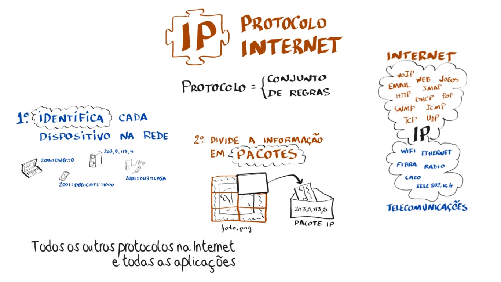
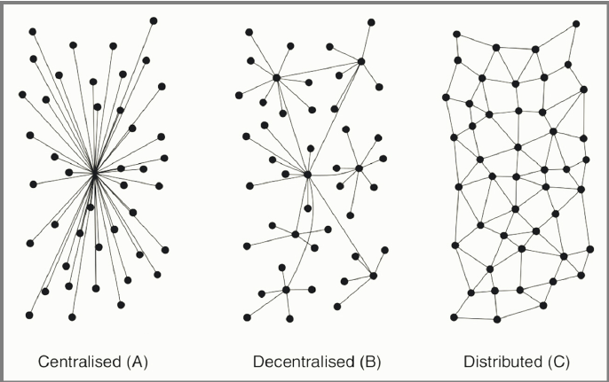

# Aula 1 - 5/08

# Apresentação

## Apresentação

* Nome
* O que faz?
* Por que está fazendo a pós?
* Uma coisa que gosta da Internet
* Uma coisa que não gosta da Internet
* Tema do TCC (1 por grupo)

# Plano de Aulas

## Dia 1 - 5/08

* Apresentações
* Internet - História e Definições
* Introdução à Governança da Internet
* Resenha de artigo
* Apresentação do Trabalho
* Avaliação da aula

## Dia 2 - 12/08

* Debate
* Atores da Governança da Internet
* Direito Autoral e Propiedade Intelectual na Internet
* Privacidade
* Desenvolvimento do Trabalho
* Avaliação da Aula

## Dia 3 - 19/08

* Segurança da Informação
* Marco Civil da Internet
* Tópicos Emergentes (Neutralidade, Blockchain)
* Desenvolvimento do Trabalho
* Avaliação da Aula

# Combinados

## Combinados

* Todos atentos ao tópico de discussão na sala
* Uma fala por vez
* Podem interromper a aula todo momento
* Toda dúvida é bem vinda
* Eu não sei de tudo (mas irei buscar o quê não sei)
* Plano e formato das aulas não está fechado

# Post-its

## Post-its

* 3 assuntos que espera ver na disciplina

# Plano de Aulas

## Dia 1 - 5/08

* Apresentações
* Internet - História e Definições
* Introdução à Governança da Internet
* Resenha de artigo
* Apresentação do Trabalho
* Avaliação da aula

## Dia 2 - 12/08

* Debate
* Atores da Governança da Internet
* Direito Autoral e Propiedade Intelectual na Internet
* Privacidade
* Desenvolvimento do Trabalho
* Avaliação da Aula

## Dia 3 - 19/08

* Segurança da Informação
* Marco Civil da Internet
* Tópicos Emergentes (Neutralidade, Blockchain)
* Desenvolvimento do Trabalho
* Avaliação da Aula

# Intervalo

# Construindo uma definição conjuntamente

## Definindo Internet e Governança da Internet

* Escrevam com suas palavras o quê entendem por internet e Governança da Internet

## Perguntas para guiar

* O quê é Internet?
* Como você classificaria a Internet? Meio de comunicação? ...
* A Internet é similar à outras coisas?
* O quê é Governança?
* Por quê uma matéria sobre isso?
* Por quê uma matéria sobre isso num curso de mídias digitais?
* De quem é a Internet?
* Existe um governo central da Internet?
* Alguém pode "desligar" a Internet?

## Definindo Internet e Governança da Internet

* Preencher pad

http://pad.w3c.br/p/governanca2017senac

# Almoço

# Internet - História e Definições

## Vídeo 1 - Como funciona a internet - Protocolo IP
https://www.youtube.com/watch?v=HNQD0qJ0TC4&list=PL4OojPHu710FqAnrMJumWhdlVnoaRpi-h

## Como funciona a internet

* Pontos importantes?
* Dúvidas?

## Como funciona a internet

* Web, Email , Jogos Onlines são aplicações da internet

* Web != de Internet

* Importância de entender como a internet funciona

## Como funciona a internet

* Internet usa infra estrutura de meios de comunicação (é um meio de comunicação?)

## Protocolo IP

## Como funciona a internet - IP

* Protocolo IP
* * Endereço
* * Divide informações em pacotes
* * Sobre diversos meios físicos , e base para diversos protocolos

* Comutação de pacotes x Comutação de circuitos
  * traceroute

* Endereço Único

## Vídeo 2 - Sistemas Autônomos
https://www.youtube.com/watch?v=C5qNAT_j63M&index=2&list=PL4OojPHu710FqAnrMJumWhdlVnoaRpi-h

## Sistemas Autônomos

* Pontos importantes
* Dúvidas

## Sistemas Autônomos

* Internet = Rede de Redes

Conceito fundamental que permite por exemplo você ter utilizar o mesmo tipo de infra-estrutura da internet na sua casa ou em uma empresa, independente da conexão com o resto da internet estar disponível

* Você pode subir na sua casa um serviço que pode ser visto à partir de qualquer lugar do mundo

* Você pode subir uma série de serviços exclusivos para seu prédito por exemplo

## Sistemas Autônomos

Que serviço/projeto você poderia criar nesse contexto? Que facilitaria sua vida ou das pessoas que vivem/trabalham próximo à você?

## Sistemas Autônomos

* Independência técnica e administrativa

* Provedores de Acesso , Provedores de conteúdo, Provedores de Trânsito
  * Exemplos de cada um?
  * Backbone da internet: provedores de provedores

## Sistemas Autônomos

* Tanto os serviços que usamos, como os usuários estão nas extremidades da rede

Google, facebook, ... não estão no núcleo "lógico e físico" da rede.
Na verdade o seu computador, logicamente falando, é igual ao do google do ponto de vista da Internet

## Sistemas Autônomos

* Núcleo simples e neutro

* Aplicações e inteligência nas pontas

* Protocolo comum entre ASs

## Sistemas Autônomos

* Custo do Enlace físico

* Tráfego de dados entre os ASs: Acordo comercial ou não
  * Não existe autoridade central que diga como os ASs tem que se interligar

## Sistemas Autônomos

* PTTs
* http://ix.br/

## Vídeo 3  - DNS
https://www.youtube.com/watch?v=ACGuo26MswI&index=3&list=PL4OojPHu710FqAnrMJumWhdlVnoaRpi-h

## DNS

* Pontos importantes
* Dúvidas?

## DNS

* Servidores ?

## DNS

* Sistema distribuído e Hierárquico

## DNS

## DNS

* Diferença entre servidores web/email e DNS

## DNS

* Processo de consulta DNS
(inserir figuras)
* * fazer consulta com comandos

## DNS

* Endereços IPs (IPV6 e IPv4)

## DNS

* CGI.br e NIC.br
