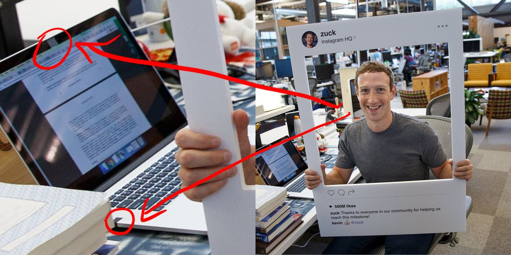

# Revisão Aula 1

## Revisão Aula 1

* Internet = Rede de Redes
* Internet contém diversos serviços rodando sobre
  * Web
  * Email
  * Bittorrent
  * ...
* Protocolo IP / Número IP
* DNS
  * Responsável por converter nomes (www.sp.senac.br), em número ip
* Domínios:
  * gTLDs : .com, .org, .amazon
  * cTLDs: .br, .pt, .ar (Responsabilidade dos países)

* Diversos orgãos cuidam de recursos críticos da Internet
  * IANA
  * ICANN
  * IETF

# Definindo Governança da Internet

## Governança da Internet

* Governança reflete diferentes persepectivas abordagens e interesses de políticas

## Interesses

* Diferentes agentes tem interesses diferentes:
  * profissionais  de computação
  * profissionais e telecomunicação
  * ativistas dos direitos humanos
  * advogados
  * políticos
  * diplomatas

## Definição

* CMSI (Cúpula Mundial sobre a Sociedade da Informação) define:
> " Governança da Internet é o desenvolvimento e a aplicação pelos Governos, pelo setor privado e pela sociedade civil, em seus respectivos papéis, de princípios, normas, regras, procedimentos de tomadas de decisão e programas em comum que definem a evolução e o uso da Internet"

## Definição

* Termos mais amplos para Internet: "Sociedade da Informação" e "Tecnologia da Informação"

## Definição

* Termo governança vem de governar sobre qualquer assunto (por exemplo assuntos de uma instituição privada) e não só sobre governos

# Classificações

## Quatro áreas principais (relatório GMTI)

* Infrestrutura e gestão de recursos críticos
* Questões de uso da internet (inclusive spam, segurança e crime cibernético)
* Questões relevantes à internet mas com impacto além (como propriedade intelectual, comércio internacional)
* Questões de desenvolvimento da governança (mais especificamente ligado à criação de capacidades nos países em desenvolvimento)

## IGF Atenas2006
* acesso
* segurança
* diversidade
* abertura
(no IGF Rio entrou gestão de recursos críticos)

## DiploFoundation
* Existe de 40 a 50 questões principais
  * Infraestrutura e padronização
  * Jurídica
  * Econômica
  * Desenvolvimento
  * Sociocultural

# Inimputabilidade da rede

* Responsabilização dos autores de ilícitos da rede (não responsabilizar provedor de conexão ou provedor de conteúdo)

# Direito Autoral e Propriedade Intelectual

## Propriedade Intelectual

* Definição da Organização da Propriedade Intelectual (OMPI):
> “a soma dos direitos relativos às obras literárias, artísticas e cientificas, às interpretações dos artistas intérpretes e às execuções dos artistas executantes, aos fonogramas e às emissões de radiodifusão, às invenções em todos os domínios da atividade humana, às descobertas científicas, aos desenhos e modelos industriais, às marcas industriais, comerciais e de serviço, bem como às firmas comerciais e denominações comercias, à proteção contra a concorrência desleal e todos os outros direitos inerentes à atividade intelectual nos domínios industrial, científico, literário e artístico”

## Propriedade Intelectual

* Proteger criadores de inovações e novidades
* Ramo do direito que protege criações intelectuais
* Garante aos titulares direitos econômicos:
  * comercialização
  * circulação
  * utilização
  * produção
* Garante propriedade ou exclusividade resultante da atividade intelectual nos campos
  * industrial
  * científico
  * literário
  * artístico

## Propriedade Intelectual

* Principais vertentes:
  * Direito Autoral
  * Propriedade industrial
  * Sui Generis (não comentar)

## Direito autoral

* Direito Autoral
>  É um conjunto de direitos morais e patrimoniais sobre as criações do
espírito,  expressas  por  quaisquer  meios  ou  fixadas  em  quaisquer  suportes,  tangíveis  ou intangíveis,  que  se  concede  aos  criadores  de  obras  intelectuais.  A  proteção  aos  direitos autorais  não  requer  nenhum  tipo  de  registro  formal.  Tratam-se  de  direitos  exclusivos  e monopolísticos

## Direito autoral
* Obras artísticas, estéticas e literárias

## Direito autoral

* Não é necessário registro
* Automaticamente protegido no momento da criação

## Propriedade industrial
* Marcas
* Patentes
* Desenhos Industriais
* Indicações Geográficas

## Propriedade Industrial
*  Pode ser solicitada somente por criações que serão usadas em indústria, empresas e comércio

* Sua determinação ocorre por meio da solicitação de patentes

* É necessário processo para garantir a propriedade

* No Brasil quem gerencia é o INPI - Instituo Nacional da Propriedade Industrial

* INPI analisa requisitos legais para conceder o direito de propriedade intelctual
  * inovação
  * originalidade
  * função para sociedade

## Propriedade Industrial
* Validade de 20 anos após liberação
* Busca evitar surgimento desleais
* Voltado para questões técnicas e econômicas da sociedade

## Exemplos de propriedade intelectual concedida

* concessão de patentes de invenção e de modelo de utilidade
* registro de desenhos industriais;  
* registro  de  marcas

## Direito Autoral e Direito Patrimonial

* Origem Moral: Ligação da obra criada e o autor
  * Irrenunciáveis e inalienáveis
  * Intransferíveis
  * Ex: direito do autor ter seu nome indicado na obra
* Origem Patrimonial: Autorização de reprodução e comunicação ao público
  * Podem ser transferidos
  * Cessão, licença, ou outra
  * Terceiros podem usufruir economicamente

## Direito de Autor e Direitos Conexos
  * Direito de autor
>direito que o criador de obra intelectual tem de gozar dos
produtos resultantes da reprodução, da execução ou da representação de suas criações

  * Direitos conexos
> interesses jurídicos de pessoas e organizações eu contribuem para tornar as obras acessíveis ao público ou acresentam à obra seu talento criativo, conhecimento técnico ou competência em organizaçao

## Direito de Autor e Direitos Conexos

* No Brasil:
  * Direitos Autorais = Direito de Autor + Direito Conexos

* Titulares de direitos conexos:
  * artista, sobre sua interpretação ou execução
  * produtor de fonogramas, sobre sua produção sonora
  * organismo de radiodifusão, sobre sua emissão

## Limitações e excessões
  * Cópias de pequenos trechos
  * Citações para debate
  * Execução musical e representação teatral no recesso familiar

## Limitações e excessões
  * Lei brasileira é muito restritiva
  * Proibido cópia privada de obra integral
  * Reprodução para utilização de portadores de necessidade

## Domínio Público
  * No Brasil: até 70 anos após a morte do autor
  * Audiovisual: 70 anos após a sua divulgação
  * Passado o prazo obra pode ser livremente divulgada e reproduzida (com ressalva aos direitos morais)

## Gestão Coletiva
  * Administração dos direitos de autor e direito conexo por associações
  * Tem direito de negociar condições de uso e protege-las de uso não autorizado
  * Funções principais  
    * Arrecadação
    * Distribuição
  * ECAD - Escritório Central de Arrecadação e Distribuição

## Problemas nas legislação brasileira
  * Falta de equilíbrio entre
    * autores e investidores (autores ficam refens de contratos 'leoninos')
    * titulares e membros da sociedade (limitações e exceções)
    * custo de implementação e benefícios por ela proporcionado

* Ausência de supervisão, regulação e promoção coletiva de direitos
* Carência de instância administrativa de mediação de conflitos e arbitragem na área autoral

## DRM

* Gestão de direitos digitais

## Referências
http://nte.ufabc.edu.br/cursos-internos/ntme/wp-content/uploads/2015/09/FundamentosEaD_Unidade5_Direitos.pdf

http://www.meudireitoautoral.com/qual-diferenca-entre-propriedade-industrial-e-direito-autoral/

http://200.201.88.180/nit/index.php/propriedade-intelectual/o-que-e-propriedade-intelectual

# Cultura Livre

## Algumas histórias

* Caso Aviões

* Caso FM x RCA

## Cultura Livre

* Cultura comercial

* Cultura não-comercial

* Foco da lei estava na criatividade comercial
  * Lei dava incentivo para os criadores, dando-lhes direitos exclusivos sobre seu trabalho criativo: podendo vender
  * Essa parte da cultura era apenas uma parte, balanceada com a outra (livre)

## Cultura Livre

* Esse equilibrio foi rompido, com um cenário criado pela Internet
  * Cada vez mais substituímos uma cultura livre por uma cultura de permissão
* A mudança é justificada para proteger a criatividade comercial
  * Esse protecionismo não visa proteger os artistas, mas sim algumas formas de negócio
  * Corporações ameaçadas pelo potencial da Internet se uniram para induzir legisladores a usarem a lei a seu favor

## Cultura Livre

* Caso Disney

# Justificando a pirataria?

## Pirataria

* EUA não aplicava copyright à material estrangeiro no início de sua histórias

* Copiadores Asiáticos
  * Erro Moral
  * Erro Legal (infrigem as leis asiáticas)

## Pirataria

* Nenhum país pode ficar de fora da lei do copyright (hoje)

## Pirataria

* Asiáticos que compram CD por US$0,50  não comprariam o mesmo CD por US$15,0

* Ninguém está perdendo com essa venda portanto

## Pirataria

* Comparando com pegar um livro sem pagar na livraria

* Idiossicransia da pirataria intangível != Idiossicransia da pirataria tangível

## Pirataria

* Microsoft e a pirataria

* Windows == Vício?

## Pirataria

* Nem toda a pirataria necessarimente é errada

* P2P -> ninguém está vendendo o conteúdo compartilhado

## Pirataria

* Justificativa para combater: privar o autor da sua renda

* Caso Napster
  * 80 milhões de usuários em 18 meses

* Facilidade do download mudou a forma como as pessoas apreciavam músicas

* Nem todo material infrigia copyright

## Pirataria

* No material que infrigia copyright é difícil calcular o dano real

## Pirataria - usuários de redes P2P

* A) Usuários que baixam ao invés de compra-lo
* B) Usuários que baixam 1 música para conhecer, e depois compram o álbum
* C) Usuários que baixam músicas que não estão mais à venda
* D) Usuários que baixam conteúdo que não estão sob copyright

## Pirataria

* Somente D é claramente legal
* Do ponto de vista comercial somente A é claramente prejudicial
* B ilegal, mas claramente benéfico
* C ilegal, mas bom para a sociedade

## Pirataria

* A retórica contra a pirataria busca simplificar essa questão

* Da mesma forma que os compositores reclamaram da pianola, os músicos reclamaram do rádio, a TV aberta reclamou da TV a cabo, a industria musical reclama que o tipo A de compartilhamento é um tipo de "roubo" que está "devastando" a indústria

## Pirataria

* Apesar dos números sugerirem que compartilhamento é prejudicial, quão prejudicial é algo difícil de estipular

* Caso da fita cassete
  * Queda de vendas em 1981 de 111%
  * Surgimento da MTV -> recuperação

## Pirataria

* Questão principal não é se A é prejudicial

* Questão é quanto A é prejudicial, e quão benéfico os demais tipos de compartilhamento são

## Pirataria

* Poderia a indústria estar perdendo com o caso A o equivalente ao que ganha com o caso B?

* Queda de 8,2% de venda de CD em 2002 (de 882 milhões para 803 milhões)

* Queda de lançamento de CD de 20% de 1999 à 2002

* Aumento do preço: 7,2% de 1999 a 2001

* No mesmo período de queda de 8,2%: 2,1 bilhões de CDs copiados (2,6 vezes o total de CDs vendidos)

## Pirataria

* Situação difícil de analisar

* Questão da indústria "Qual a diferença entre copiar uma música da Internet e roubar um CD"?

* Se não houvesse diferença queda seria de mais de 100%

## Pirataria -  Benefícios

* Caso C: milhões de músicas que não estão disponíveis comerciamente
* Maior parte do caso, distribuidor desistiu de vender por não ver vantagem econômica
* Semelhante aos sebos (não precisam pagar direitos autorais aos donos do direito autoral)
* Porém diferente, pois quem está compartilhando não está ganhando dinheiro com isso
* Diferente pois quando se copia uma música, a original continua existindo

* Se o tipo C fosse proibido, por que não proibir os sebos e bibliotecas?

## Caso D

* Sem infrigimento de copyright
* Obras em domínio público
* Se para resolver o problema do tipo, precisamos eliminar o tipo D, perdemos algo muito importante para a sociedade

* Enquanto a industria fonográfica diz "perdemos esse valor", temos que nos questionar "quanto ganhamos com as redes P2P"
  * Que tipo de conteúdo é esse que de outra forma não estaria disponível?
  * Muito do que a pirataria compartilha é legal e bom

* O grande ponto deveria ser maximizar os benefícios do tipo D, e minimizar os danos gerados pelo tipo A

* Questão de equilíbrio

## Pirataria

* A luta judicial deveria ser somente contra o tipo A
* Caso Napster: chegou a oferecer uma solução que eliminava 99,4% dos compartilhamento ilegal, mas não foi aceito
* Napster deveria elimitar completamente a quebra de copyright
* Se 99,4% não é suficiente, então o que temos é uma guerra contra as tecnologias de compartilhamento
* Assim como não é possivel que uma máquina XEROX, gravadores de CD e armas serão usados 100% do tempo dentro da lei
* Significa perder os benefícios do compartilhamento

## Pirataria

* Essa situação não busca equilíbrio (diferente da história das inovações)

## Direito de Imagem

* Consagrado e protegido pela Constituição Federal da República de 1988 e pelo Código Civil Nacional de 2002 como um direito de personalidade autônomo

* Se trata da projeção da personalidade física da pessoa, incluindo os traços fisionômicos, o corpo, atitudes, gestos, sorrisos, indumentárias

*  Qualquer pessoa que se sentir ofendida com alguma publicação indevida de sua imagem sem a sua autorização pode entrar em juízo e cobrar indenização em razão disso
  * Importante provar o dano
  * Caso seja para uso comercial não é necessário provar dano

## Quebra de Patentes

* Caso patentes medicamento para tratamento HIV

## Caso Aaron Swartz

## Caso SciHub

# Privacidade

## Privacidade

## Privacidade

* http://www.slate.com/blogs/future_tense/2017/08/04/facebook_is_fighting_biometric_facial_recognition_privacy_laws.html

## Privacidade

* Privacidade
> Direito do cidadão de controlar suas próprias informações pessoais e decidir sobre elas (divulgar ou não)

## Privacidade

* Direito humano fundamental

* Reconhecida na "Declaração Universal dos Direitos Humanos" e "Pacto internacional sobre Direitos Civis e Políticos" e muitas outras convenções

## Privacidade

* Normalmente se concentram
  * privacidade da comunicação
  * privacidade da informação

* Antigamente focada somente em questões governamentais, agora incluí setor empresarial

## Questões

* Pessoas e Estados
* Pessoas e empresas
* Estados e empresas
* Pessoas e pessoas

## Pessoas e Estados

* Informação: ferramenta para estado exercer autoridade sobre território e pessoas

* Diversos dados coletados pelo estado
  * certidões de nascimento e casamento
  * título de eleitor
  * antecedentes criminais
  * informações sobre impostos
  * ...

## Pessoas e Estados

* O indivíduo não pode escolher não apresentar dados pessoais antes de imigrar para outro país

* Tecnologia de agregação e correlação dos dados (Big Data) permite buscar padrões comuns, incomuns e inconsistências

## Pessoas e Estados

* Desafio: garantir equilíbrio adequado entre a modernização das funções do govenro e a garantia dos direitos privados

* Limitar a coleta de informações do que é estritamente necessário para a função

* Nota-se o aumento por coleta de informações para identificação obrigatório (dados biométricos)

* Lei Patriota (Patriot Act)
dos EUA e outras legislações ampliaram a autoridade dos governos para coletar informações

## Pessoas e empresas

* Utilizar serviços como abrir uma conta, reservar um vôo ou fazer uma busca deixam inúmeros rastros

* Êxito e sustentabilidade do comércio eletrônico depende de confiança nas políticas de privacidade empresarial e medidas de segurança para proteger informações confidenciais

## Pessoas e empresas

* Especificamente nas redes sociais existe preocupação de uso indevido pelo administrador e por outras pessoas que participam dela

* Dados sobre os clientes e suas preferências se tornam um importante bem de mercado

* Empresas como facebook, google e amazon, tem como pilar de seus modelos de negócio essas informações

* Os dados dos indivíduos são a moeda que paga os serviços gratiutos ("não existe almoço grátis")

## Dados dos usuários

* Dados cadastrais
* Pesquisas realizadas
* Rede de contratos
* Comportamento
* Textos escritos (publicados ou não)
* Curtidas/Compartilhadas
* Localização
* Posição dos olhos, face ?

## Algumas tecnologias de coleta de dados

* Cookies
* Pixel Tracking

## Regras para proteção de dados pessoais armazenados

http://www.staffs.ac.uk/legal/privacy/10_rules/

## Pwned

* https://haveibeenpwned.com/

## Termos de uso

* https://tosdr.org/

## Estados e Empresas

* Pode haver compartilhamento de dados coletados por empresas com outras empresas e Estados

* Impedir atividades terroristas

* Em algumas situações estados monitoram os dados detidos por empresas

## Pessoas e pessoas

* Tecnologias como o celular "democratizou" a possibilidade de espionagem por pessoas

* Voyeurismo

* Leis específicas para tais casos (nos EUA Lei de Prevenção do Voyeurismo de Vídeo)

## Legislações

* Convenção do Conselho da Europa para a proteção de Indivíduoas com respeito ao Processamento Autmático de Dados Pessoais - 1981
  * Resistiu ao tempo por ser neutra em termos tecnológicos
  * Pode ser aderida por países não europeus

* Diretiva de Proteção de Dados da UE (Diretiva 45/46/EC)

* Diretrizes para Proteção da Privacidade e dos Fluxos Transfronteiriços da OCDE (não vinculativo)

## Legislação

* Diferença de implementação na Europa e EUA

* Europa: Legislação Abrangente para proteção de dados
  * Executadas por autoridade públicas

* EUA: regulaçõa é elaborada por cada setor da economia (finanças, crianças, serviços médicos, cada um com uma legislação específica)
  * Realizada principalmente pelo setor privado e pela autorregulação
  * Empresas estabelecem políticas e cabe a elas e aos indivíduos decidir sobre as políticas

* No modelo dos EUA as pessoas ficam em posiçõa vulnerável

## Marco Civil Brasileiro

* Prevê que empresas que trabalham com dados para fins de publicidade não podem oferecer seus dados para terceiros sem seu consentimento

* Dados armazenados dos usuários só pode ser quebrada com ordem judicial
  * Não pode ser solicitados dados genéricos ou coletivos (deve ser específico)
  * Precisará publicar anualmente relatórios de quantas requisi ções cadastrais fez, para onde e o número de usuários afetados, além de dizer quais são os
padrões que utiliza para proteger esses dados.

## Marco Civil Brasileiro

* Usuários podem solicitar que seus dados sejam completamente excluídos de um serviço (rede social por exemplo)

* Garantia de privacidade no email

* Ilegalidade de cooperação das empresas de internet com órgãos de informação estrangeiros

## Marco Civil Brasileiro

* Provedor de acesso (ISP) não pode armazenar seu rastro na internet, mas devem guardar registro de conexão por 12 meses

* Provedor de conteúdo deve manter registro por 6 meses (podem usar esses dados nesse período, mas não podem coletar dados que não sejam necessário ao combinado com o usuário)

* Cabe ao CGI.br promover estudos e recomendar procedimentos, normas e padrões técnicos e operacionais” para guarda, armazenamento e tratamento de dados pessoais e comunicações privadas.

* Existe uma demanda de uma lei específica para isso

## Caso Snowden

file:///home/kropotkin/ownCloudFedel/palestras/SemTecIFSP2014/apresentacao.svg#frame7071

## Deep Web?

* Deep Web, Dark Web
* Tor
