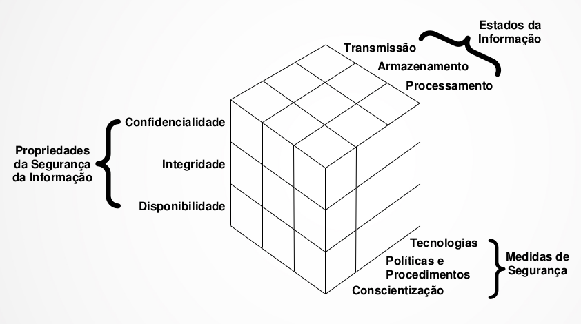
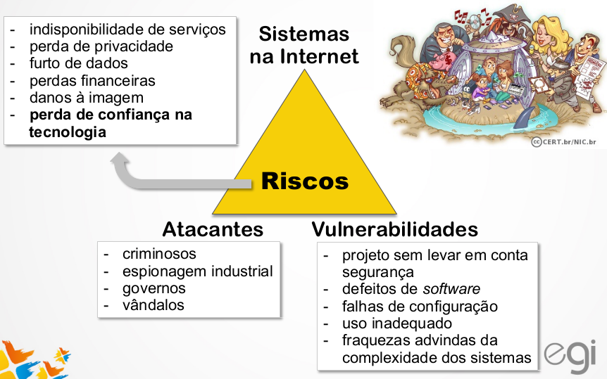
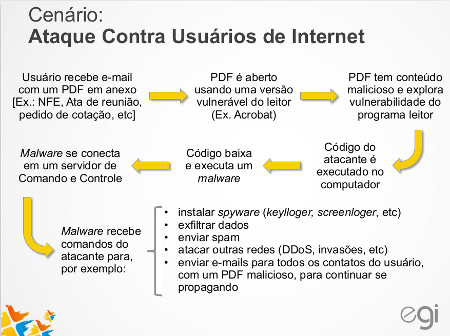
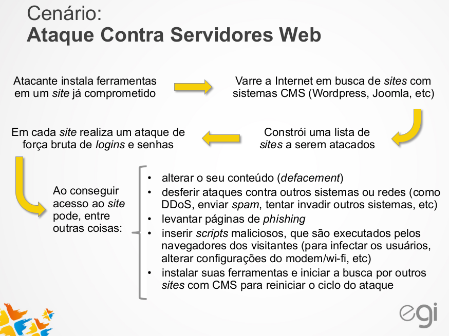

## Plano para a aula 3

* Manhã
  * Segurança
  * Tempo para preparação para o Debate
* Tarde
  * Debate
  *
  * Tempo para desenvolvimento do Trabalho

# Segurança da Informação

## Propriedades

* Confidencialidade
* Integridade
* Disponibilidade

## Confidencialidade

* É a necessidade de garantir que as informações sejam divulgadas somente para aqueles que possuem autorização para
vê-las

> Alguém obtém acesso não autorizado ao seu computador e lê seus
todas as informações contidas na sua declaração de Imposto de Renda

## Integridade

* É a necessidade de garantir que as informações não tenham sido alteradas acidentalmente ou deliberadamente, e que elas
estejam corretas e completas.

> Alguém obtém acesso não autorizado ao seu computador e
altera informações da sua declaração de Imposto de Renda, momentos antes de você enviá-la à Receita Federal.

## Disponibilidade

* É a necessidade de garantir que os propósitos de um  sistema possam ser atingidos e que ele esteja acessível àqueles que dele precisam.

> O seu provedor sofre uma grande sobrecarga de dados ou um
ataque de negação de serviço e por este motivo você fica impossibilitado de enviar sua declaração de Imposto de Renda à Receita Federal .

## Modelo de Segurança da Informação

## Riscos em sistemas conectados à internet

# Criptografia

## Criptografia

> Estudo dos princípios e técnicas pelas quais a informação pode ser transformada da sua forma original para outra *ilegível*, de forma que possa ser conhecida apenas por seu destinatário, o que torna *difícil* de ser lido por alguém não autorizado

## Criptografia

* Chave simétrica
* Chave assimétrica

## Criptografia

* Texto claro é cifrado, transmitido, e então decifrado

## Objetivos da Criptografia

* confidencialidade da mensagem
* integridade da mensagem
* autenticação do remetente
* não-repúdio ou irretratabilidade do remetente

## Chame Simétrica

* A mesma chave para cifrar e decifrar
* As duas partes necessitam possuir a mesma chave (desvantagem)

## Chame Assimétrica  

* Chave pública e chave privada

## Chave Assimétrica

# Proteção de dados via criptografia

## Proteção de dados via criptografia

* SSL/TLS, SSH e IPSec – protocolos que, por meio de criptografia,
fornecem confidencialidade e integridade nas comunicações entre um
cliente e um servidor.

* HTTPS

## Proteção de dados via criptografia

* VPN – termo usado para se referir à construção de uma rede privada
utilizando redes públicas (por exemplo, a Internet) como infraestrutura. Em geral utilizam criptografia para proteger os dados em trânsito. ­  Existem serviços na Internet que dizer fornecer uma VPN, mas que apenas fornecem serviços de proxy que “ocultam” o IP de origem – a maior parte destes serviços não cifra o conteúdo em trânsito.

## Proteção de dados via criptografia

* PGP – programa que implementa operações de criptografia, como
cifrar e decifrar conteúdos e assinatura digital. Normalmente utilizado em conjunto com programas de e-mail.

# Cenários de Ataques

## Cenário 1

## Cenário 2

## Códigos Maliciosos

https://cartilha.cert.br/fasciculos/codigos-maliciosos/fasciculo-codigos-maliciosos.pdf

## Ataques

* Capítulo 3. Ataques na Internet
http://cartilha.cert.br/ataques/

## Mecanismos de Segurança

* Capítulo 7. Mecanismos de segurança
http://cartilha.cert.br/mecanismos/

## Tratamento de Incidentes de Segurança da Internet

https://www.youtube.com/watch?v=flu6JPRHW04

## Caso Snowden e Glenn Greenwald

# Marco Civil da Internet
